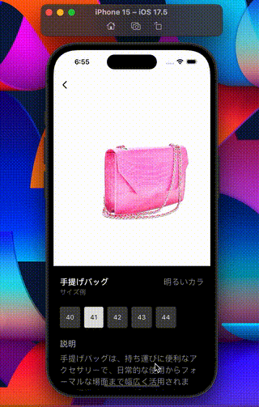

# Model animation

<!-- For displaying a static screenshot -->
<!-- Make sure the path matches your image location -->
<!-- If your screenshot is in assets/screenshot.png, use: -->

## User Interface

<p style="line-height: 0;">
  
</p>

## Getting Started

### Prerequisites

- Flutter (Latest Version)
- Dart SDK
- Android Studio / VS Code

### Installation

1. Clone the repository

   ```bash
   git clone https://github.com/emeleonufavour/food_store_ui.git
   ```

2. Navigate to project directory

   ```bash
   cd projectname
   ```

3. Install dependencies

   ```bash
   flutter pub get
   ```

4. Run the app
   ```bash
   flutter run
   ```

## Contributing

Contributions are welcome! Please feel free to submit a Pull Request.

This project is a starting point for a Flutter application.

A few resources to get you started if this is your first Flutter project:

- [Lab: Write your first Flutter app](https://docs.flutter.dev/get-started/codelab)
